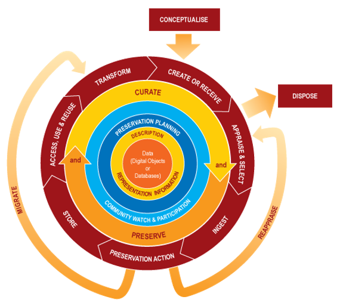

<h3 align="center">Research Paper </h3>
<h1 align="center">Big Data Curation: Necessity and Benefits</h1>
 
Gartner defines Big Data as “high volume, high velocity, and high variety information assets that require new forms of processing to enable enhanced decision making, insight discovery and process optimization.” Considering the amount of data being generated rapidly a significant portion of Big Data’s success will depend upon data quality. Data quality can highly impact the analysis and important decision-making problems. Increased number of new platforms for data creation, as well as the growing availability of open data on the web, along with an increase in the number of data sources within organizations has resulted in an unprecedented volume of data to be managed. As a result, we need to use tools which will consider the factors of big data and will improve decision making and reduce operational inefficiencies. 

Curation of data is the process of preserving its value. By collecting data from various sources, a data curator can create a much more valuable information source when integrating and aggregating it. Through this paper we will go through the advantages and lifecycle of data curation along with data curation lifecycle which will help us to understand the need of data curation as well as benefits of using it.

<h2> What is Data Curation? </h2>

The data curation is the end-to-end process which includes data quality, data validation, and human-data interaction to ensure data requirement for storage and usage throughout the data lifecycle. To increase the usefulness of data, data curation provides methodological and technological data management assistance. Which makes the data curation process an important step in big data's success.[1]

Below Fig. 1 shows the key difference between multiple steps involved in the big data value chain. First step is collecting the data which leads to the next step involving semantic analysis, data discovery, community, and cross-sectoral analysis. After this initial analysis data curation processes can be started which are categorized as content creation, selection, classification, transformation, validation, and preservation. The selection and implementation of a data curation is a multidimensional problem.

<h5 align='center'> Figure 1. Data curation in the big data value chain </h5>

<h2> Why is Data Curation essential for Big Data? </h2>

Curating data allows people to collect and control the data so that they can make various uses of it. No matter how huge the datasets may be, data curation can help us systematically manage them so that the analysts. It makes the way of managing data very easy and eventually it leads to engaging users, promoting data discovery and analysis.[2] 

-  Before any analysis data is cleaned and then used. That step happens at a very local level. Meaning, considering specific problems statements and cleaning the data according to the related topic will not be helpful to everyone.Data Curation facilitates collecting and controlling the data that all can make use of in their various ways before it is being cleaned for a particular problem. In an organization, data collection, processing, and validation are impossible without Data Curation. Which makes this step very important in big data handling, since managing huge amounts of data from various sources and in various formats can be irritating. 

- It becomes very easy to maintain the quality of the data if we do the data curation at the initial stage. Considering the volume and variety of big data, one can get lost entirely without Data Curation.

- An enterprise-scale data lake which is a centralized repository of data of many types which enables easy accessibility are generally used in organizations. It can be difficult to locate, evaluate, or utilize data in data lakes since they quickly become swamps of information without data curation.

- Artificial Intelligence has made breakthroughs in this past decade. Particularly machine learning and deep learning algorithms have made big steps towards understanding the consumer space. Data curation can help into effective model learning and guide the model to get optimum results. 

<h2> Common steps in Data Curation </h2>

  

<h5 align='center'> Figure 2. The DCC Curation Lifecycle Model </h5>

In Fig 2, the Data Curation lifecycle represents all the stages of data throughout its life from data generation to its distribution and reuse.[3]
1. 	**Data or Digital objects or Database:** The first layer represents Data itself which is a key component of the model. This core component can be in different formats like databases, complex digital objects, or any type of file.
2. 	**Description and Representation of Information:** In the second layer appropriate standards were used to describe metadata so that it will be accessible over a long period.
3. 	**Preservation and Planning:** This third layer focuses on the planning for preservation of data which generally requires management and administration of data creation.
4. 	**Community watch and Participation:** In this phase, tracking of various community activities is done using standards and tools.
5. 	**Curate and Preserve:** This fifth layer emphases on implementation of all the planning done in previous layers regarding data curation.
6. 	The sixth layer of the Data Curation lifecycle model includes multiple phases from data creation, data cleaning and validation, data transformation to archives along with data storage.

<h2> Big Data Curation Platforms</h2>

After the discussion of the Data curation lifecycle, it may seem like this process is very complicated but it’s not the case. There are many platforms and tools available to make this task easy. We have understood why there’s a growing emphasis on leveraging the power of Data Curation. These tools have unique features that can cater to specific requirements. Depending on the business requirement and type of data we need to identify the right tool. For rapidly moving data we can use Stitch Data tool which is a cloud and developer centered platform [4]. Businesses which are focused on data integration can use Talend which is an open-source solution which helps integrate, clean, mask and profile data. Alation, Informatica and Alteryx are tools which provide a variety of products like ETL, data masking, data quality and are great at deploying and sharing analytics in a scalable way for quality insights.

Data curation will be no exception, as Artificial Intelligence has an impact on everything. These AI based Data Curation tools use machine learning to validate metadata and organize findings into the appropriate repository. AI driven tools like Atacama ONE combine organization features with interactive data management, a dependable data analysis engine, machine learning, and many implementation options.

<h2>Conclusion</h2>
Data curation is more concerned with metadata management and maintenance than with the database itself. It encompasses a wide range of procedures and activities associated with the organizing and aggregation of data gathered from numerous sources. It is a procedure that is iterative and capable of adding value to data. Considering all these points we can confidently say that data curation is here to stay.

<h2> References </h2>

1. Freitas, A., Curry, E. (2016). Big Data Curation. In: Cavanillas, J., Curry, E., Wahlster, W. (eds) New Horizons for a Data-Driven Economy. Springer, Cham. https://doi.org/10.1007/978-3-319-21569-3_6

2. Singh, D.(2019).The Role of Data Curation in Big Data.Data Science Central. https://www.datasciencecentral.com/the-role-of-data-curation-in-big-data

3. Higgins, S.(2008). The DCC Curation Lifecycle Model. The International Journal of Digital Curation. https://doi.org/10.2218/ijdc.v3i1.48

4. Patel, H. (2019). Six of the Best Data Curation Tools. Medium. https://medium.com/hackernoon/six-of-the-best-data-curation-tools-in-2019-d26cd2103d57

5. Mixson, E. (2021). 5 Things to Know About Data Curation. AI, Data & Analytics Network. https://www.aidataanalytics.network/data-science-ai/articles/5-things-to-know-about-data-curation 

6. Pouchard, L (2015). Revisiting the Data Lifecycle with Big Data Curation. The International Journal of Digital Curation. https://doi.org/10.2218/ijdc.v10i2.342 

